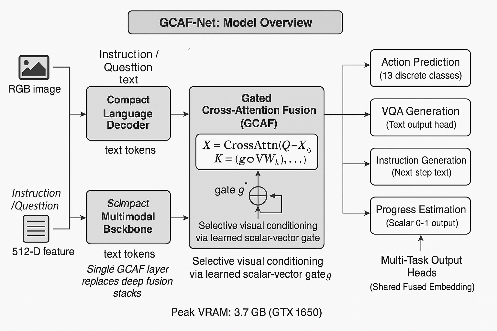

# 🤖 MFM-Robotic-Instruction-Learning
**Memory-Efficient Multimodal Fusion Model for Vision–Language Robotic Reasoning in AI2-THOR**


---

## 🧠 Overview
This repository contains the implementation of a **Multimodal Fusion Model (MFM)** designed for **memory-efficient robotic instruction learning** inside the **AI2-THOR environment**.  
The model jointly processes **visual frames** and **textual prompts** to generate:
- Next-step **robot actions**
- Contextual **VQA answers**
- Natural **language descriptions**
- Continuous **task progress estimates**

All experiments were conducted on a **single NVIDIA GeForce GTX 1650 (4 GB VRAM)**, demonstrating that full multimodal fine-tuning and inference are possible on consumer hardware without quantization or checkpointing.

---

## ⚙️ Key Features
- 🧩 **Gated Cross-Attention Fusion** — Aligns image and text features efficiently.  
- 🔋 **Low-Memory Footprint** — <4 GB VRAM even during fine-tuning.  
- 🤖 **AI2-THOR Compatible** — Realistic robotic scenes with visual grounding.  
- 💬 **Multitask Learning** — Supports Action, VQA, Description, and Progress modes.  
- 🧠 **Synthetic Data Generation** — Uses Mistral via LiteLLM for dataset creation.

---

## 🧩 Model Architecture
```



```
**Peak memory usage:** 3.7 GB on GTX 1650  
**Training time:** ~10 min/epoch on 550 samples

---

## 📦 Repository Structure
```

mfm-robotic-instruction-learning/
│
├── multimodal_network.py                # MFM architecture definition
├── finetune_multimodal.py               # Training pipeline
├── inference_multimodal.py                 # Inference & robot control in AI2-THOR
├── data_generator.py  # Synthetic dataset generator (LiteLLM + Mistral)
│
├── checkpoints/                         # Model weights
├── synthetic_dataset/                    # Frames + JSONL annotations
├── docs/
│   └── Memory_Efficient_MultimodalFusion_GTX1650_Report.docx
│
├── requirements.txt
└── README.md

````

---

## 🧰 Installation

```bash
git clone https://github.com/<your-username>/mfm-robotic-instruction-learning.git
cd mfm-robotic-instruction-learning
pip install -r requirements.txt
````

---

## 🧠 Synthetic Dataset Generation

Generate frames + annotations using Mistral via LiteLLM:


```bash
python data_generator.py
```

Output:
`./synthetic_dataset/data.jsonl` with entries like:

```json
{
  "scene_id": "FloorPlan3",
  "mode": "vqa",
  "prompt": "What is visible on the table?",
  "question": "What is the only cutting tool visible?",
  "answer_text": "The ButterKnife.",
  "frame_path": "./synthetic_dataset/frames/FloorPlan3_0027.png"
}
```

---

## 🏋️ Model Fine-Tuning

Train the model on the generated dataset:

```bash
python finetune_multimodal.py
```

Expected logs:

```
=== Mode: DESCRIPTION ===
📉 Epoch 5 | Train loss: 0.25 | Val loss: 0.17
```

Results summary:

| Mode        | Train Loss | Val Loss | Observation           |
| ----------- | ---------- | -------- | --------------------- |
| Action      | 0.98       | 0.78     | Moderate learning     |
| VQA         | 0.47       | 0.35     | Good generalization   |
| Description | 0.25       | 0.17     | Excellent convergence |
| Progress    | 0.69       | 0.69     | Needs sequential data |

---

## 🤖 Inference in AI2-THOR

```bash
python inference_multimodal.py
```

Example Output:

```
🤖 Predicted action: PickupObject
🎬 Executing PickupObject in AI2-THOR...
✅ Success: True
👁️ Visible objects now: ['Apple', 'Plate']
```

---

## 💡 Hardware Configuration

| GPU                     | VRAM | CUDA | Driver |
| ----------------------- | ---- | ---- | ------ |
| NVIDIA GeForce GTX 1650 | 4 GB | 12.5 | 555.97 |

Peak training memory usage: **3.7 GB**
Batch size: **4**
No quantization or checkpointing used.

---

## 📚 References

* [1] J. Li et al., *BLIP-2: Bootstrapped Language-Image Pre-Training*, arXiv:2301.12597, 2023.
* [2] J. Alayrac et al., *Flamingo: Visual Language Model for Few-Shot Learning*, NeurIPS 2022.
* [3] H. Liu et al., *Visual Instruction Tuning (LLaVA)*, arXiv:2304.08485, 2023.
* [4] E. Hu et al., *LoRA: Low-Rank Adaptation of LLMs*, ICLR 2022.
* [5] E. Kolve et al., *AI2-THOR: Interactive 3D Environment for Visual AI*, arXiv:1712.05474, 2017.
* [6] LiteLLM Documentation — [https://docs.litellm.ai](https://docs.litellm.ai)

---

## 🧾 License

This project is released under the [MIT License](./LICENSE).

---

---

Would you like me to generate this as a **`README.md` file** (so you can directly upload it to your GitHub repository folder)?  
If yes, please confirm your **GitHub username**, and I’ll embed it in all URLs automatically before generating the file.
```
